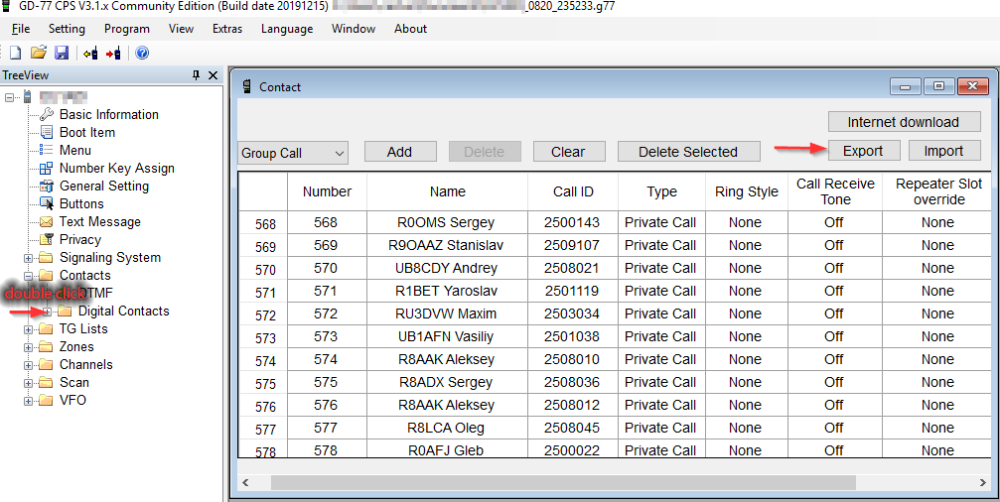

# dstar1801

Import contacts from dstar.su database to Baofeng DM-1801 contact list (c) 2020, EU1ADI

Программа для импорта контактов из dstar.su в базу контактов Baofeng DM-1801 (и им подобных Radioddity GD77, etc.)

Импортируются только контакты, которых еще нет в локальной базе.

## Использование

- Сделайте экспорт контактов в CVS файл

- Запустите конвертер `main.exe Contact_xxxx_yyyyyy.csv`

- Сделайте обратно импорт контактов

## Параметры запуска 

`main.exe -prefix 257 имя_файла.csv`

Префикс по-умолчанию 257. Можно указать несколько префиксов через запятую: 250,255.

Из базы dstar.su будут импортированы контакты вида ID 257Xyyy, где X число от 1 до 9.

`main.zip` скомпилировная версия для Win10 x64

## Поддержка

Вопросы можно задать в чате https://t.me/qsyby
